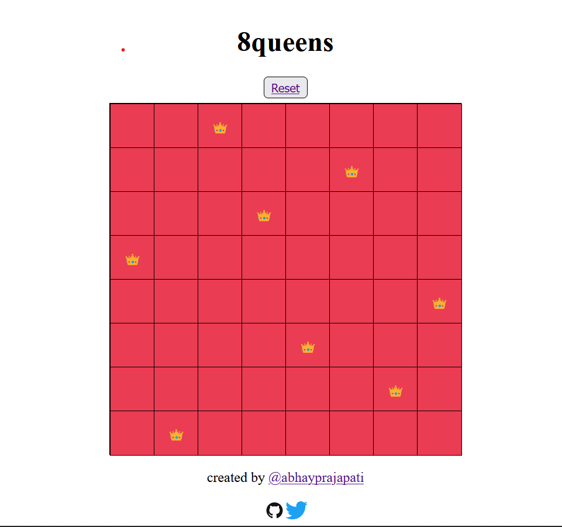

# nqueens-board
## solve n queens problem

create with 💗 by [@abhayprajapati](https://twitter.com/abhayprajapati_)

**give you recommendations for features and improvements**
###future Updates:
1. UNABLE TO PLACE QUEENS IF THAT AREA IS RED.
2. CONGRATULATE USERS ON SUCCESSFULLY COMPLETING THE MAZE.
3. turn all the cells to green when the user completes the maze.
4. share on twitter / socials.