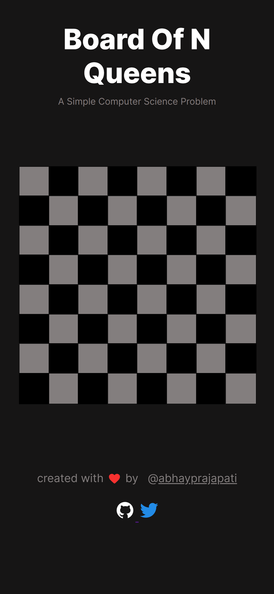
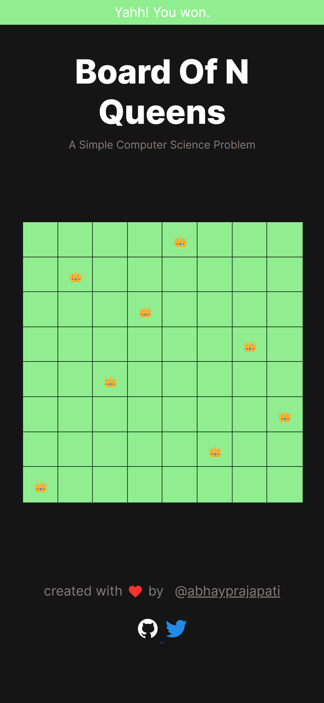

# Board of N-Queens
A famous computer science problem is the inspiration for this maze.

There are eight queens in the maze. They must be arranged in a certain order without any rows, columns, or dialogues intersecting each other in order to solve the maze.
It is essential to know that N Queen refers to a chess board on which only n number of queens can be present at the same time.

There are n rows and n columns in this case, which indicates how many rows and columns there are. As an example, if the chess board measures 4 by 4, it will have four queens, whereas if the board measures 8 by 8, it will have eight queens. 

When a queen is placed on a cell (at a specific place), no other queens can be placed on the same row, column, or diagonal as that queen. As a result of this maze, a very significant question arises in the field of computer science called the N QueeProblem.

In this problem, we must find the correct solution within a limited number of attempts. You might be able to solve it if you try.
## Solve N-Queen Problem

create with 💗 by [@abhayprajapati](https://twitter.com/abhayprajapati_)

### Recommend features and improvements 
#### Future updates will include:
1. As soon as the user completes the maze, all the cells will turn green.
2. Share on Twitter and social media.